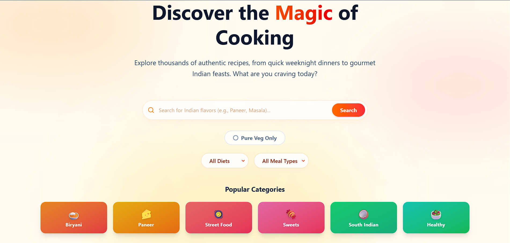

# 🍽️ Rasoi Magic - Premium Recipe Finder

**Live Demo:** [https://rasoi-magic-omega.vercel.app/](https://rasoi-magic-omega.vercel.app/)

A beautifully designed, premium Recipe Finder application built with React, Vite, and Tailwind CSS. Rasoi Magic helps you discover delicious recipes tailored to your dietary needs with a smooth, glassmorphism-inspired interface and an authentic Indian touch.

 
*(Replace this with your own screenshot or keep this AI-generated mockup)*

## ✨ Top Features

### 🍛 Authentic Indian Experience
- **Premium Theme**: Rich mesh gradients and warm colors (Saffron, Red, Amber).
- **Popular Categories**: Instant access to favorites like **Biryani**, **Paneer**, **Street Food**, **Sweets**, and **South Indian**.
- **Strict Veg Toggle**: A dedicated switch to filter for **Pure Vegetarian** recipes instantly.

### 💖 Personalization & Sharing
- **My Cookbook (Favorites)**: Save your favorite recipes locally with a single click.
- **WhatsApp Share**: Share recipes directly with friends and family via WhatsApp with the live link.

### 🔍 Powerful Discovery
- **Smart Search**: Find recipes by ingredients (e.g., "chicken, lemon").
- **Advanced Filters**: Filter by Diet (Vegan, Keto, Gluten-Free) and Meal Type.
- **Detailed Insights**: View preparation time, servings, health scores, and nutrition.

### ⚡ Modern UI/UX
- **Glassmorphism Design**: Frosted glass effects and smooth animations.
- **Mobile-First**: Fully responsive with full-screen details on mobile.
- **Sticky Header**: Easy navigation with a live favorites counter.
- **Professional Footer**: Quick links, newsletter mock, and social integration.

---

## 🛠️ Tech Stack

- **Frontend**: [React](https://react.dev/) + [Vite](https://vitejs.dev/)
- **Styling**: [Tailwind CSS v4](https://tailwindcss.com/)
- **Icons**: [Lucide React](https://lucide.dev/)
- **Animations**: [Framer Motion](https://www.framer.com/motion/)
- **API**: [Spoonacular API](https://spoonacular.com/food-api)

---

## 🚀 Getting Started

Follow these steps to get the project running locally.

### Prerequisites

- Node.js (v18 or higher)
- npm or yarn

### Installation

1.  **Clone the repository**
    ```bash
    git clone https://github.com/owsam22/rasoi-magic.git
    cd rasoi-magic
    ```

2.  **Install dependencies**
    ```bash
    npm install
    ```

3.  **Configure API Key**
    - Get a free API Key from [Spoonacular](https://spoonacular.com/food-api/console#profile).
    - Create a `.env` file in the root directory:
      ```env
      VITE_SPOONACULAR_API_KEY=your_actual_api_key_here
      ```

4.  **Run the App**
    ```bash
    npm run dev
    ```
    Open [http://localhost:5173](http://localhost:5173) in your browser.

---

## 📬 Connect with me

Made with ❤️ by **[owsam22](https://github.com/owsam22)**

- **GitHub**: [owsam22](https://github.com/owsam22)
- **Instagram**: [@owsam22](https://instagram.com/owsam22)
- **LinkedIn**: [Samarpan](https://linkedin.com/in/samarpan22)

---

## 📄 License

This project is licensed under the MIT License - see the [LICENSE](LICENSE) file for details.
